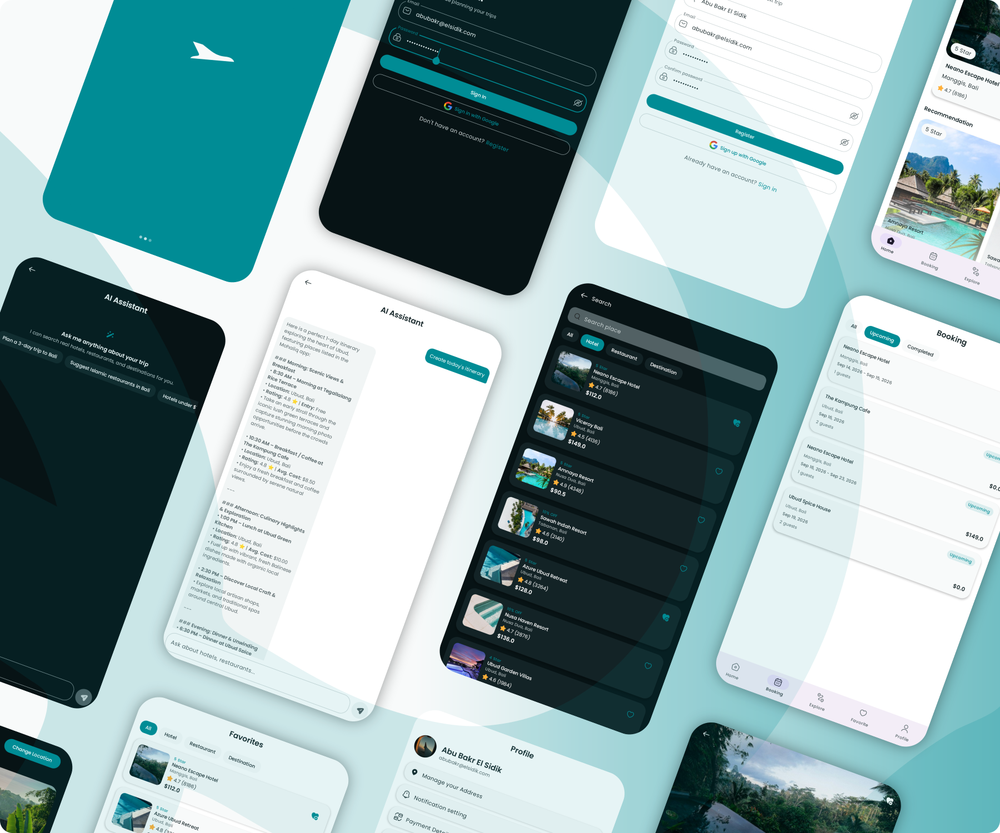
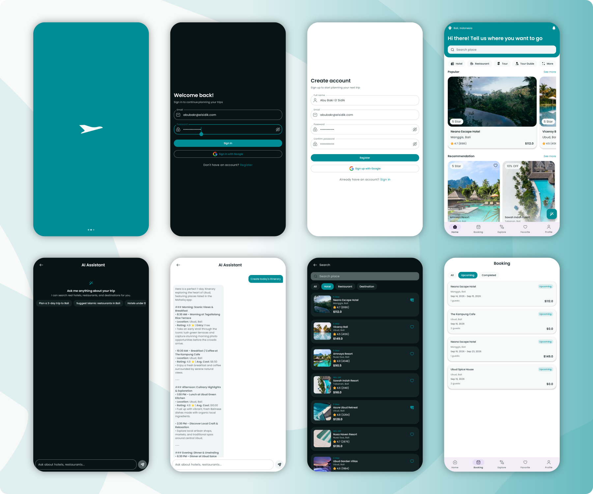
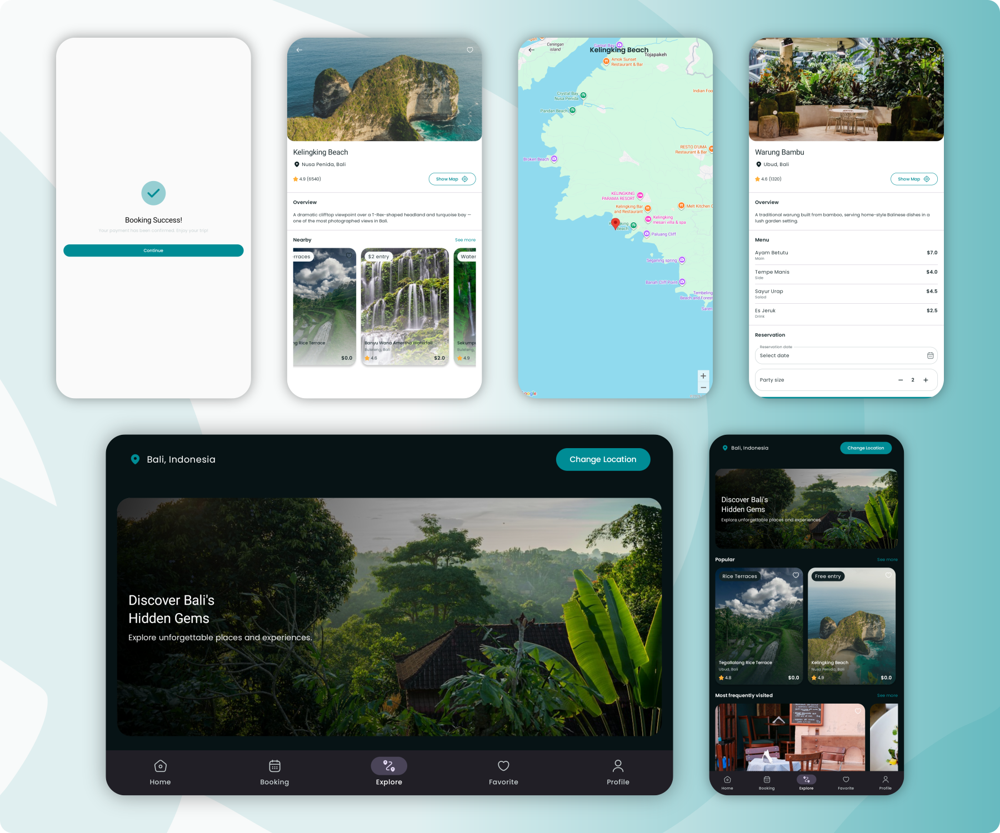
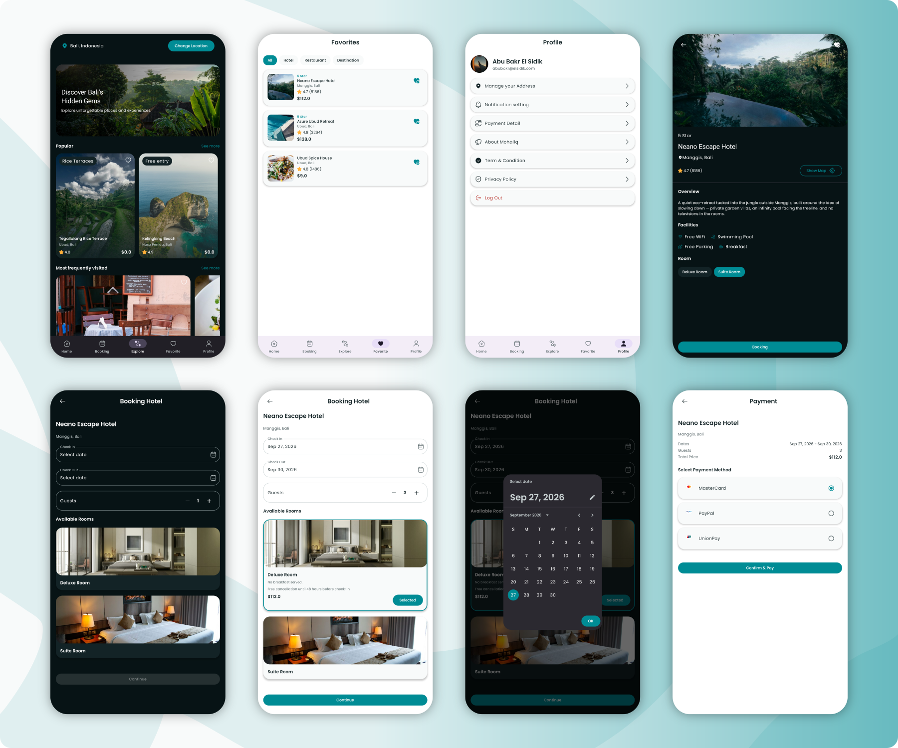
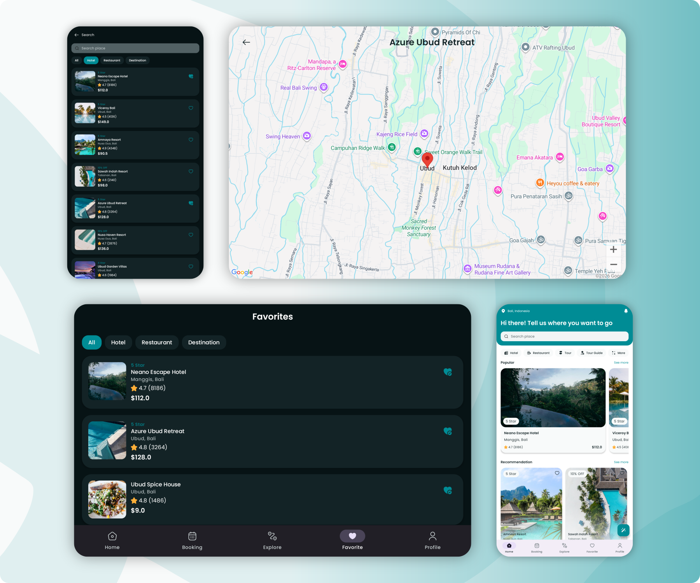

<div align="center">


# Mohaliq

**A modern Android travel planner & discovery app, built entirely with Jetpack Compose.**

A portfolio project demonstrating production-style Android development with
Kotlin, Jetpack Compose, MVVM, Hilt, Room, DataStore, Retrofit, Google Maps,
Coil, and a real AI assistant with tool-calling over the app's own data.

</div>

---

## Demo

https://github.com/user-attachments/assets/0b31f978-1a6a-46ca-96d5-1d88d7e3b754

## Screenshots

<p align="center">
  
  
  
  
  
  
  
  
  
</p>

---

## Try It

The easiest way to try Mohaliq is the pre-built APK — no setup, no API keys, everything (including Maps and the AI Assistant) works out of the box:

**[⬇ Download the latest APK](../../releases/latest)**

Mohaliq uses a self-contained fake authentication flow (no real backend or account creation needed to explore the app):

- **Email:** anything containing `@` — it doesn't need to be a real address
- **Password:** at least 6 characters

Use those to either **Log In** or **Register** and land straight on Home.

> **Building from source instead?** Everything works identically *except* Google Maps — the bundled Maps key is restricted to the exact signing certificate the release APK above is signed with (this is intentional, so the key can't be lifted from a public repo and abused). A build from source will show a blank/grey map unless you configure your own key — see [Building From Source](#building-from-source) below. The AI Assistant is unaffected either way — it isn't tied to any signing certificate.

---

## Features

- **Discovery** — Home, Explore, and Search, all backed by a real local Room database (not static mock data)
- **Hotels** — detail pages, image galleries, room selection, full booking flow with real date pickers
- **Restaurants** — detail pages, menu, table reservations
- **Destinations** — detail pages with real coordinates
- **Payments** — a complete mock checkout flow that creates a real booking record on confirmation
- **Favorites** — persisted per place, reflected live across every screen
- **Booking History** — every real booking/reservation made in-app, upcoming vs. completed
- **Profile & Auth** — session persistence via DataStore; logout actually clears it
- **Google Maps** — real map screens for every hotel, restaurant, and destination
- **AI Travel Assistant** — a genuine LLM-backed chat assistant with **tool-calling**: when asked for recommendations, it searches the app's real hotel/restaurant/destination data instead of inventing answers
- **Full light/dark theming** throughout

## Tech Stack

| Layer | Tools |
|---|---|
| Language | Kotlin |
| UI | Jetpack Compose, Material 3 |
| Architecture | MVVM, unidirectional UiState/Action/Event per feature |
| DI | Hilt |
| Local persistence | Room, DataStore |
| Networking | Retrofit, OkHttp, kotlinx.serialization |
| Images | Coil |
| Maps | Google Maps Compose |
| Concurrency | Kotlin Coroutines, Flow / StateFlow |
| Navigation | Navigation Compose |
| AI backend | Cloudflare Workers (proxy) → Google Gemini, with tool-calling |

## Architecture

Most interactive features follow the same unidirectional architecture pattern:

```
Screen  →  Action  →  ViewModel  →  Event  →  Route  →  Navigation
```
The UI reads state from the ViewModel and emits user actions, while
navigation-related side effects are exposed as events. Simple
utility/entry-point features such as Map and Splash are intentionally
lighter where the full pattern would add unnecessary structure.

The UI layer only ever reads `UiState` and emits `Action`s — it never talks to a repository directly. ViewModels never touch Compose. Repositories are the only thing that knows Room/Retrofit exist. This pattern is applied consistently across the app's interactive features,
while simpler entry-point and utility screens remain intentionally lightweight.

### The AI Assistant, specifically

This is the part of the app most worth looking at closely. The assistant isn't just a chat UI wrapped around an API call — it has **real tool-calling** against the app's own data:

```
User asks a question
        │
        ▼
Android app  ──────────▶  Cloudflare Worker  ──────────▶  Google Gemini
(AiRepository)             (rate-limits, holds            (decides whether it
                            the real API key)               needs real data)
        ▲                                                          │
        │                                                          ▼
        │                                          if it needs data: returns
        │                                          a tool-call request instead
        │                                          of a text answer
        │                                                          │
        └──────── app executes the tool against ────────────────────┘
                   the real Room database (PlaceRepository),
                   sends results back, gets a grounded final answer
```

Ask it *"suggest a hotel under $100"* and it will search the app's actual seeded hotel data and answer with a real result — not a hallucinated one.

**Why a Cloudflare Worker sits in between:** an API key bundled directly in an Android app can always be extracted by decompiling the APK — there's no way around this for any key without an app-signature-based restriction mechanism (which most AI providers don't offer, unlike Google Maps). The Worker keeps the real key server-side; the app only ever talks to the Worker, which is a plain URL with per-device and global rate-limiting, not a secret.

The Worker's full source is included in this repo, under [`/mohaliq-ai-proxy`](./mohaliq-ai-proxy) — it's genuinely tiny (~50 lines), and already deployed, so the AI feature works for anyone using this app without needing their own API key or their own deployment.

## Project Structure

```
com.habib.mohaliq
├── app/                 # DI modules, navigation graph, MainActivity
├── core/
│   ├── data/            # Room database, DataStore, repositories, network (Retrofit)
│   ├── designsystem/    # Shared UI components, theme, typography
│   └── model/           # Domain models shared across features
├── feature/             # One package per feature (home, hotel, booking, ai, ...),
│                         # each following Screen/Action/ViewModel/Event/Route
mohaliq-ai-proxy/         # Cloudflare Worker source (AI backend proxy)
```
The project is organized by responsibility rather than by screen type,
with shared infrastructure and UI components isolated in `core/` and
each product feature encapsulated under `feature/`.

## Building From Source

1. Clone the repo and open it in Android Studio
2. Create `local.properties` in the project root (if Android Studio didn't already) and add:
   ```
   MAPS_API_KEY=your_own_key_here
   ```
   Get a free key from [Google Cloud Console](https://console.cloud.google.com) (enable "Maps SDK for Android"). Without this, the app still builds and runs fully — the map screens just won't render tiles.
3. Sync Gradle and run

The AI Assistant needs no setup — it's pre-configured to call the already-deployed Cloudflare Worker.

### Running your own copy of the AI proxy (optional)

Only needed if you want a fully independent deployment (e.g. forking this project for your own portfolio):

1. `cd mohaliq-ai-proxy`
2. `npx wrangler login`
3. `npx wrangler secret put GEMINI_API_KEY` (get a free key from [Google AI Studio](https://aistudio.google.com))
4. `npx wrangler deploy`
5. Update the Worker URL in `NetworkModule.kt` to your new deployment's URL

## Design Credit

Most of the UI (~90%) is adapted from the **[Woosh UI Kit — Travel Booking App](https://www.figma.com/community/file/1497489735023508578/travel-booking-app-woosh-ui-kit)** Figma community template. The AI Assistant and Maps screens are original designs, since no reference existed for them in the source kit.

## About This Project

Mohaliq is a portfolio project built to demonstrate practical, production-style Android development — clean architecture, a real local data layer, and a genuinely functional AI integration, rather than a UI-only demo. Built as a step toward freelance Android (Kotlin) development work.
